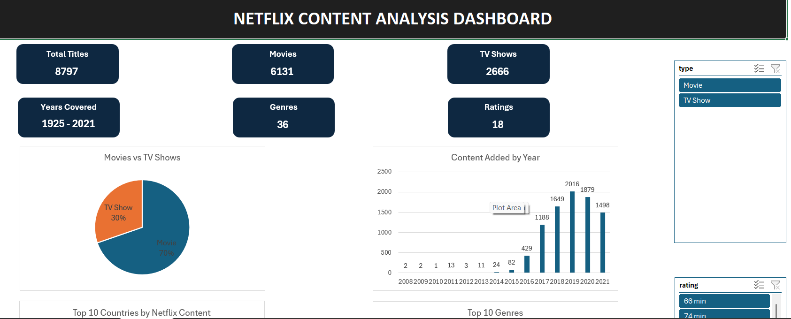

# 🎬 Netflix Content Analytics Dashboard

## 📌 Project Overview

This project is an interactive Microsoft Excel dashboard built using the Netflix Movies & TV Shows dataset.

The dashboard helps analyze Netflix's content library through interactive PivotTables, PivotCharts, KPI Cards, and Slicers, enabling users to explore content trends and gain business insights.

---

## 📊 Dashboard Preview

### Main Dashboard

---

## 🎯 Objectives

- Analyze Netflix Movies vs TV Shows
- Identify content growth over the years
- Discover the most popular genres
- Find the top contributing countries
- Analyze content ratings
- Identify top directors
- Identify top actors
- Build an interactive dashboard using Excel

---

## 📈 KPI Cards

- Total Titles
- Movies
- TV Shows
- Years Covered
- Total Genres
- Total Ratings

---

## 📊 Dashboard Visualizations

- Movies vs TV Shows
- Content Added by Year
- Top 10 Countries
- Top 10 Genres
- Content Rating Distribution
- Top 10 Directors
- Top 10 Actors

---

## 🎛 Interactive Filters

- Type
- Rating
- Genre

---

## 🛠 Tools Used

- Microsoft Excel 2024
- Pivot Tables
- Pivot Charts
- KPI Cards
- Slicers
- Data Cleaning
- Data Visualization

---

## 💡 Key Insights

- Movies account for approximately 70% of Netflix's catalog.
- Most content was added between 2018 and 2020.
- The United States contributes the highest number of Netflix titles.
- Drama is the most common genre.
- TV-MA is the most frequent content rating.
- A small number of directors have produced a large number of Netflix titles.

---

## 📂 Dataset

Netflix Movies & TV Shows Dataset

---

## 🚀 Skills Demonstrated

- Data Cleaning
- Data Transformation
- Dashboard Design
- Data Visualization
- Business Intelligence
- KPI Reporting
- Pivot Table Analysis
- Interactive Dashboard Development

---

## 👤 Author

**Rishav Lal**

Aspiring Data Analyst
